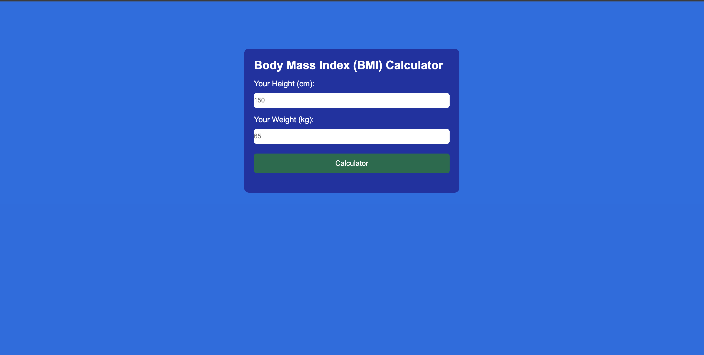
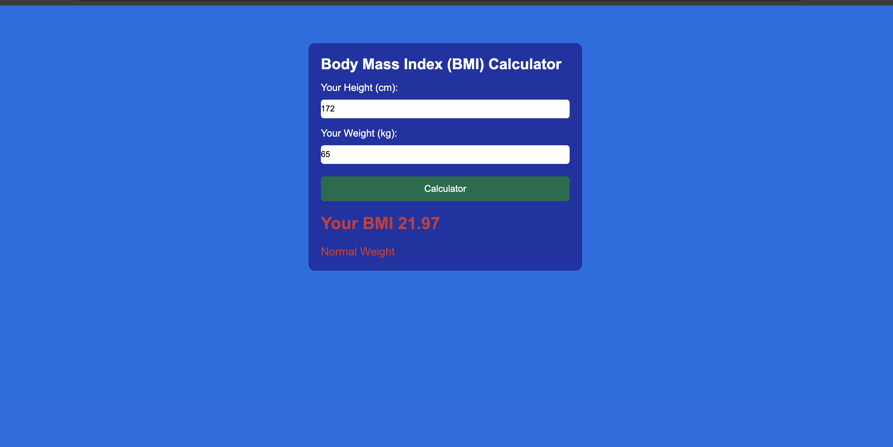

# ⚖️ Body Mass Index (BMI) Calculator

A simple and responsive **BMI (Body Mass Index) Calculator** built using **HTML5**, **CSS3**, and **JavaScript**. This application allows users to calculate their BMI by entering their height and weight and instantly displays the BMI value along with the corresponding health category.

## ✨ Features

* Calculate BMI instantly
* User-friendly interface
* Responsive design
* Input validation
* Displays BMI value up to 2 decimal places
* Shows BMI category:

  * Underweight
  * Normal Weight
  * Overweight
  * Obese

## 🛠️ Technologies Used

* HTML5
* CSS3
* JavaScript

## 📂 Project Structure

```text
BMI-Calculator/
│
├── index.html
├── style.css
├── script.js
├── images/
└── README.md
```

## 🚀 How It Works

1. Enter your height (in centimeters).
2. Enter your weight (in kilograms).
3. Click the **Calculate BMI** button.
4. The application calculates your BMI instantly.
5. Your BMI value and health category are displayed on the screen.

## 📊 BMI Categories

| BMI Range      | Category      |
| -------------- | ------------- |
| Below 18.5     | Underweight   |
| 18.5 – 24.9    | Normal Weight |
| 25.0 – 29.9    | Overweight    |
| 30.0 and Above | Obese         |

## 📸 Screenshots

### Home Page



### Result




## 🌐 Live Demo

Add your GitHub Pages or Netlify link here.

## 👨‍💻 Author

**Suraj Kumar**

B.Tech Computer Science, University of Lucknow

